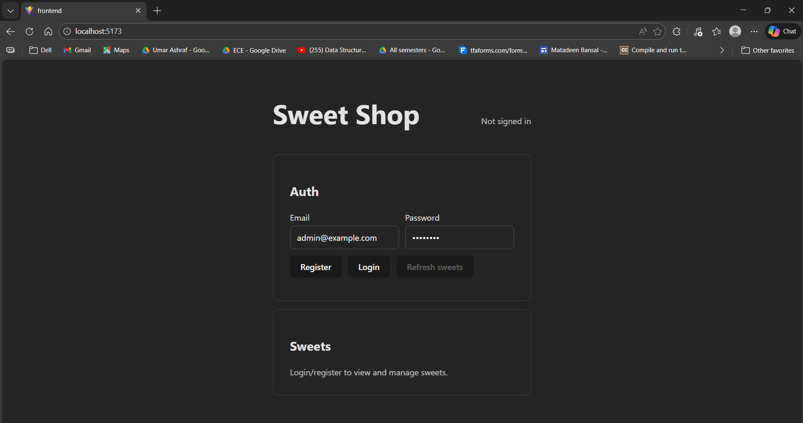
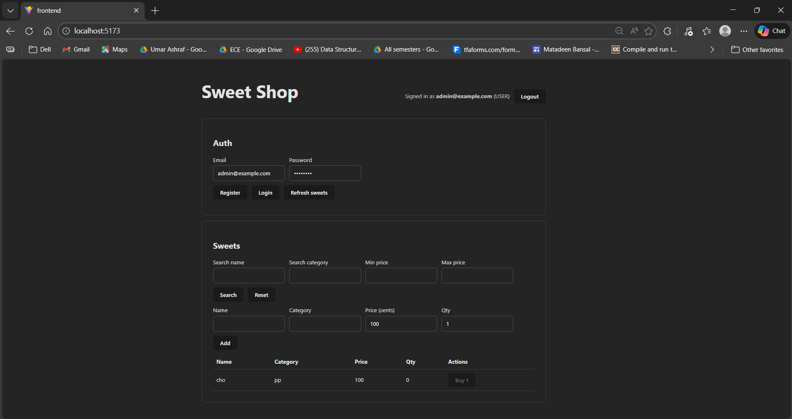

# Sweet Shop Management System

A full-stack Sweet Shop Management System (SPA + REST API) with authentication, inventory management, and search.

This repository contains:
- A REST API (Express + Prisma + SQLite) with JWT auth and role-based access (ADMIN/USER)
- A React single-page app (Vite) that consumes the API

## Tech Stack

- Backend: Node.js + TypeScript + Express + Prisma (SQLite)
- Frontend: React + Vite + TypeScript
- Testing: Jest + Supertest

## Features (Assessment Checklist)

- Auth (JWT)
	- `POST /api/auth/register`
	- `POST /api/auth/login`
- Sweets (protected)
	- `POST /api/sweets` add sweet
	- `GET /api/sweets` list sweets
	- `GET /api/sweets/search` search by name/category/price range
	- `PUT /api/sweets/:id` update sweet
	- `DELETE /api/sweets/:id` delete sweet (**admin only**)
- Inventory (protected)
	- `POST /api/sweets/:id/purchase` decreases quantity
	- `POST /api/sweets/:id/restock` increases quantity (**admin only**)

Notes:
- The first registered user becomes `ADMIN` automatically; subsequent users are `USER`.

## Setup (Windows)

### Prerequisites

- Node.js 20.19+ (or newer)

### Install

From the `sweet-shop/` folder:

```powershell
npm install
npm --prefix backend install
npm --prefix frontend install
```

If you are in the workspace root and don't want to `cd` / `Set-Location`, run:

```powershell
npm --prefix sweet-shop install
npm --prefix sweet-shop/backend install
npm --prefix sweet-shop/frontend install
```

### Backend env

Backend requires a `.env` file.

- Copy `backend/.env.example` to `backend/.env`
- Default SQLite config works out-of-the-box.

### Database setup

From the `sweet-shop/` folder:

```powershell
npm run setup:backend
```

### Run (dev)

Run both backend + frontend:

```powershell
npm run dev
```

If you are in the workspace root and don't want to `cd` / `Set-Location`:

```powershell
npm --prefix sweet-shop run dev
```

- Frontend: http://localhost:5173/
- Backend health check: http://localhost:3001/health

Troubleshooting:
- If `npm run dev` says it cannot find `package.json`, you are in the wrong folder. Use `cd sweet-shop` or run `npm --prefix sweet-shop run dev`.
- If you see `{ "ok": true }` in the browser, you're on the backend health endpoint. The UI is on `http://localhost:5173/`.

## Tests

Run backend tests:

```powershell
npm --prefix backend test
```

### Test report (file)

Generate a JSON test report:

```powershell
npm run test:report
```

Output:
- `backend/reports/jest-report.json`

## Screenshots

### Login



### Dashboard



## My AI Usage

Tools used:
- GitHub Copilot (GPT-5.2 (Preview))

How I used AI:
- Scaffolding: generated initial React/Vite client structure and API helper functions.
- Backend: validated REST endpoint coverage against the assessment requirements and extended tests.
- Debugging: resolved local dev workflow issues and improved developer-facing error messages.

Reflection:
- AI sped up boilerplate creation and helped quickly align implementation with the rubric.
- I still verified behavior by running tests and manually checking the running app.

## Deployment (Optional)

Vercel is great for deploying the frontend. The backend (Express + Prisma/SQLite) should be deployed separately (e.g., Render/Railway) or refactored into serverless functions.

### Deploy frontend to Vercel

1) In Vercel, click **New Project** → import your GitHub repo
2) Set **Root Directory** to `sweet-shop/frontend`
3) Build settings:
- Build Command: `npm run build`
- Output Directory: `dist`
4) Add environment variable:
- `VITE_API_BASE` = your deployed backend URL + `/api` (example: `https://your-backend.example.com/api`)
5) Deploy

After deploy:
- Open the Vercel URL
- Register/login should work if the backend URL is correct

## Git / Co-authorship

If you use AI during commits, include a co-author trailer in commit messages, e.g.:

```text
Co-authored-by: GitHub Copilot <AI@users.noreply.github.com>
```

